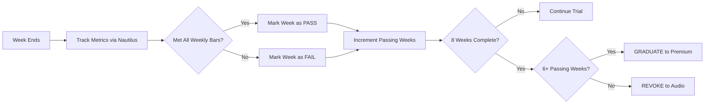

# Graduation Metrics Framework (Proposed)

## Overview
Both **Proof of Fame** and **Proof of Effort** streamers must demonstrate they bring meaningful value to the platform to graduate from their 2-month trial.

---

## 🎯 Core Principle
**Graduation = Replace Staking Revenue**

A streamer who stakes 50 SUI (~$40-50) provides:
- Platform liquidity
- Commitment signal
- No active risk

A free-tier streamer must generate equivalent value through **platform economics**:
- Prediction market volume (5% platform cut)
- Tipping activity (future 2% cut)
- Viewer engagement

---

## 📊 Proposed Graduation Standards

### Minimum Thresholds (Weekly)

| Metric | Proof of Fame | Proof of Effort |
|--------|---------------|-----------------|
| Hours Streamed | ≥10 hrs/week | ≥10 hrs/week |
| Avg Concurrent Viewers | ≥50 | ≥20 |
| Platform Revenue | ≥$50/week | ≥$50/week |
| Engagement Rate | ≥25% | ≥25% |

### Platform Revenue Calculation
```
Platform Revenue = (Prediction Volume × 5%) + (Tips × 0%)
```

**Example:**
- Prediction markets: $1,000 volume/week → $50 platform revenue
- Tips: $500/week → $0 platform revenue (0% cut in Phase 1)
- **Total:** $50/week ✅ Meets bar

### Total 8-Week Requirements
- **Cumulative Platform Revenue:** ≥$200 total
- **Passing Weeks:** 6 out of 8 weeks meet weekly bar
- **Growth Trajectory:** Show improvement in at least 3 weeks

---

## 💰 Why $200 Total?

**Economic Logic:**
- 50 SUI stake ≈ $40-50 value (at $0.75-1.00/SUI)
- Staker contributes: Capital lock, no active value
- Free-tier streamer contributes: $50 in revenue + viewer growth
- **Result:** Free-tier creates MORE value than staking

**Sustainability:**
- Platform earns $50 from free-tier vs. $0 from staker
- Proves streamer can sustain audience and monetization
- Filters out low-effort trial users

---

## 📈 Engagement Rate Definition

```
Engagement Rate = (Unique Tippers + Unique Bettors) / Total Unique Viewers
```

**Example:**
- 100 unique viewers in a week
- 20 tipped
- 10 bet on predictions
- **Engagement:** 30/100 = 30% ✅

**Why 25% Minimum:**
- Twitch avg engagement: 5-10%
- Our prediction markets + tips: Higher engagement expected
- 25% = top quartile of Twitch streamers

---

## 🔄 Weekly Evaluation Flow



---

## 🎓 Graduation Rewards

### Proof of Fame (100K+ Followers)
- **Trial:** Video tier (2 months)
- **Graduate:** **Premium** tier (all features unlocked)
- **Benefits:** Priority routing, custom branding, unlimited streaming

### Proof of Effort (New Streamers)
- **Trial:** Video tier + 10hrs/week quota (2 months)
- **Graduate:** **Premium** tier (all features unlocked)
- **Benefits:** Same as Fame graduates + bragging rights

---

## ❌ Revocation Consequences

If streamer fails to meet 6/8 weeks:
- **Downgrade:** Audio-only tier
- **To Regain Access:** Must stake SUI for Podcast/Video/Premium
- **Points:** Keep all earned points (not penalized)
- **Retry:** Can apply for Proof of Effort again after 3 months

---

## 🛠️ Implementation Notes

### Tracking (Nautilus)
All metrics derived from on-chain events:
- `RoomConnection` → Track unique viewers, watch time
- `TipSent` → Count unique tippers, tip volume
- `BetPlaced` → Count unique bettors, prediction volume
- `PredictionResolved` → Calculate platform fees

### Smart Contract
```move
struct WeeklyMetrics {
    hours_streamed: u64,
    avg_viewers: u64,
    platform_revenue_usd: u64,  // In cents: 5000 = $50.00
    engagement_rate: u64,        // Basis points: 2500 = 25%
    bar_met: bool
}

// Evaluation logic
public fun evaluate_weekly_bar(metrics: &WeeklyMetrics): bool {
    metrics.hours_streamed >= 10 &&
    metrics.platform_revenue_usd >= 5000 &&  // $50
    metrics.engagement_rate >= 2500  // 25%
}
```

---

## 🔄 Iterative Refinement

**These standards are PROPOSED** and should be adjusted based on:
1. **Phase 1 Data:** What % of trialists actually graduate?
2. **Economic Reality:** Is $200 total too high/low?
3. **Competitive Landscape:** What are Kick/Twitch doing?

**Success Metrics:**
- **Target Graduation Rate:** 30-40%
- **Platform Revenue per Graduate:** $200+
- **Retention:** Graduates have 2x retention vs. stakers

---

## 💡 Alternative Frameworks (For Discussion)

### Option A: Lower Bar, More Graduates
- Weekly revenue: $25 (vs. $50)
- Total revenue: $100 (vs. $200)
- **Pros:** More graduates, faster growth
- **Cons:** Less revenue per user

### Option B: Tiered Graduation
- $100 total → Podcast tier
- $200 total → Video tier
- $400 total → Premium tier
- **Pros:** More granular rewards
- **Cons:** More complex logic

### Option C: Time-Weighted
- Week 1-2: Lower bar ($25/week)
- Week 3-8: Full bar ($50/week)
- **Pros:** Easier to start, ramp up difficulty
- **Cons:** Gaming potential

---

**Recommendation:** Start with the proposed $50/week, $200 total framework and iterate based on real data after Month 1 of Phase 1.
