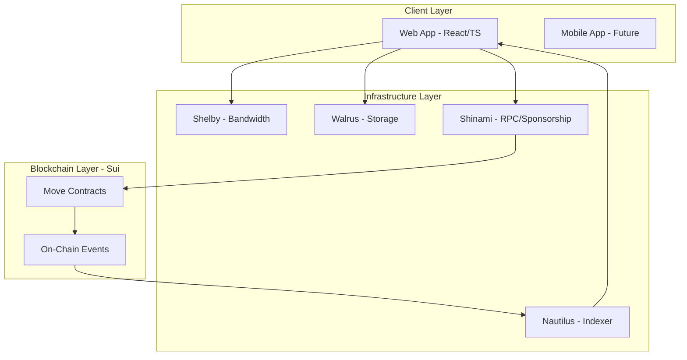

# Tai MVP - Technical Specification

## Overview
This document provides detailed technical specifications for the MVP smart contracts, infrastructure, and integration architecture.

**Token Strategy:** For MVP and Phase 1-2, the platform uses **SUI** for all economic activities (staking, tips, predictions). A **Points System** tracks user activity for future token airdrop and revenue share when the native token launches at the end of Phase 2.

---

## 🏗️ System Architecture



---

## 📦 Smart Contract Architecture

### Module Dependency Graph

```
user_profile.move (Base)
    ↓
room_manager.move (depends on user_profile)
    ↓
prediction.move (depends on room_manager)
    ↓
tipping.move (standalone, interacts with user_profile)
    ↓
points.move (tracks all activities)
```

---

## 1️⃣ User Profile Module

### Contract: `user_profile.move`

```move
module tai::user_profile {
    use sui::object::{Self, UID};
    use sui::tx_context::{Self, TxContext};
    use sui::transfer;
    use sui::coin::{Self, Coin};
    use sui::balance::{Self, Balance};
    use sui::sui::SUI;
    
    // ========== Structs ==========
    
    struct UserProfile has key, store {
        id: UID,
        tier: StakeTier,
        staked_balance: Balance<SUI>,  // Use native SUI token
        total_tips_sent: u64,
        total_tips_received: u64,
        created_at: u64,
        tier_access: TierAccess  // New: Track access method
    }
    
    struct StakeTier has store, copy, drop {
        level: u8  // 0=AUDIO_ONLY, 1=PODCAST, 2=VIDEO, 3=PREMIUM
    }
    
    struct TierAccess has store {
        access_method: AccessMethod,
        proof_data: Option<ProofData>,
        effort_quota: u64  // For Proof of Effort: weekly minutes remaining
    }
    
    struct AccessMethod has store, copy, drop {
        type: u8  // 0=STAKED, 1=PROOF_FAME, 2=PROOF_EFFORT, 3=GRADUATED
    }
    
    struct ProofData has store {
        granted_at: u64,
        expires_at: u64,
        weekly_metrics: VecMap<u64, WeeklyMetrics>,
        status: ProofStatus
    }
    
    struct ProofStatus has store, copy, drop {
        value: u8  // 0=TRIAL, 1=GRADUATED, 2=REVOKED
    }
    
    struct WeeklyMetrics has store, copy, drop {
        week_number: u64,
        hours_streamed: u64,
        avg_viewers: u64,
        engagement_rate: u64,  // Basis points: 3000 = 30%
        bar_met: bool
    }
    
    // Tier requirements (in SUI, 1 SUI = 1e9 MIST)
    const TIER_AUDIO: u64 = 1_000_000_000;         // 1 SUI
    const TIER_PODCAST: u64 = 10_000_000_000;      // 10 SUI
    const TIER_VIDEO: u64 = 50_000_000_000;        // 50 SUI
    const TIER_PREMIUM: u64 = 100_000_000_000;     // 100 SUI
    
    // Proof of Fame/Effort constants
    const TRIAL_DURATION_MS: u64 = 5_184_000_000;  // 60 days
    const WEEKLY_EFFORT_QUOTA: u64 = 600;  // 10 hours = 600 minutes
    
    // ========== Events ==========
    
    struct ProfileCreated has copy, drop {
        profile_id: ID,
        owner: address,
        timestamp: u64
    }
    
    struct TierUpgraded has copy, drop {
        profile_id: ID,
        old_tier: u8,
        new_tier: u8,
        amount_staked: u64
    }
    
    struct ProofOfFameGranted has copy, drop {
        profile_id: ID,
        tier: u8,
        expires_at: u64
    }
    
    struct ProofOfEffortGranted has copy, drop {
        profile_id: ID,
        weekly_quota: u64,
        expires_at: u64
    }
    
    struct ProofGraduated has copy, drop {
        profile_id: ID,
        access_method: u8,  // 1=FAME, 2=EFFORT
        final_tier: u8
    }
    
    // ========== Public Functions ==========
    
    public fun create_profile(ctx: &mut TxContext): UserProfile {
        // Creates base profile with AUDIO_ONLY tier
    }
    
    public fun stake_for_tier(
        profile: &mut UserProfile,
        payment: Coin<SUI>,
        ctx: &mut TxContext
    ) {
        // Validate amount meets tier requirement
        // Add to staked_balance
        // Upgrade tier
        // Set access_method to STAKED
        // Emit TierUpgraded event
    }
    
    public fun grant_proof_of_fame(
        profile: &mut UserProfile,
        tier: u8,
        verified_credentials: VerifiedCredentials,  // From Enoki
        clock: &Clock,
        ctx: &mut TxContext
    ) {
        // Verify credentials meet tier requirements
        // Grant trial access
        profile.tier_access = TierAccess {
            access_method: AccessMethod { type: 1 },  // PROOF_FAME
            proof_data: option::some(ProofData {
                granted_at: clock::timestamp_ms(clock),
                expires_at: clock::timestamp_ms(clock) + TRIAL_DURATION_MS,
                weekly_metrics: vec_map::empty(),
                status: ProofStatus { value: 0 }  // TRIAL
            }),
            effort_quota: 0
        };
        
        // Emit ProofOfFameGranted event
    }
    
    public fun grant_proof_of_effort(
        profile: &mut UserProfile,
        clock: &Clock,
        ctx: &mut TxContext
    ) {
        // Grant full tier access with weekly quota
        profile.tier = StakeTier { level: 2 };  // VIDEO tier
        profile.tier_access = TierAccess {
            access_method: AccessMethod { type: 2 },  // PROOF_EFFORT
            proof_data: option::some(ProofData {
                granted_at: clock::timestamp_ms(clock),
                expires_at: clock::timestamp_ms(clock) + TRIAL_DURATION_MS,
                weekly_metrics: vec_map::empty(),
                status: ProofStatus { value: 0 }
            }),
            effort_quota: WEEKLY_EFFORT_QUOTA
        };
        
        // Emit ProofOfEffortGranted event
    }
    
    public fun deduct_effort_quota(
        profile: &mut UserProfile,
        minutes_used: u64
    ) {
        assert!(profile.tier_access.access_method.type == 2, E_NOT_EFFORT_USER);
        assert!(profile.tier_access.effort_quota >= minutes_used, E_QUOTA_EXCEEDED);
        
        profile.tier_access.effort_quota = profile.tier_access.effort_quota - minutes_used;
    }
    
    public fun reset_weekly_quota(profile: &mut UserProfile) {
        if (profile.tier_access.access_method.type == 2) {
            profile.tier_access.effort_quota = WEEKLY_EFFORT_QUOTA;
        }
    }
    
    public fun evaluate_proof_graduation(
        profile: &mut UserProfile,
        clock: &Clock
    ) {
        let proof_data = option::borrow_mut(&mut profile.tier_access.proof_data);
        
        // Count weeks that met the bar
        let total_weeks = vec_map::size(&proof_data.weekly_metrics);
        let passing_weeks = count_passing_weeks(proof_data);
        
        if (passing_weeks >= 6 && total_weeks >= 8) {
            // GRADUATE
            proof_data.status = ProofStatus { value: 1 };  // GRADUATED
            profile.tier_access.access_method = AccessMethod { type: 3 };
            
            // Both Fame and Effort graduate to Premium (all tiers unlocked)
            profile.tier = StakeTier { level: 3 };  // PREMIUM
            
            // Emit ProofGraduated event
        } else {
            // REVOKE
            proof_data.status = ProofStatus { value: 2 };  // REVOKED
            profile.tier = StakeTier { level: 0 };  // AUDIO_ONLY
        }
    }
    
    public fun unstake(
        profile: &mut UserProfile,
        amount: u64,
        ctx: &mut TxContext
    ): Coin<SUI> {
        // Enforce 7-day cooldown (check timestamp)
        // Cannot unstake below current tier requirement
        // Return coins
    }
    
    // ========== View Functions ==========
    
    public fun get_tier(profile: &UserProfile): u8 {
        profile.tier.level
    }
    
    public fun can_create_video_room(profile: &UserProfile): bool {
        // Check tier level OR active proof trial
        if (profile.tier.level >= 2) {
            return true
        };
        
        // Check if Proof of Fame/Effort is active
        if (option::is_some(&profile.tier_access.proof_data)) {
            let proof = option::borrow(&profile.tier_access.proof_data);
            return proof.status.value == 0  // TRIAL status
        };
        
        false
    }
    
    public fun can_stream_minutes(profile: &UserProfile, minutes: u64): bool {
        // For Proof of Effort users, check quota
        if (profile.tier_access.access_method.type == 2) {
            return profile.tier_access.effort_quota >= minutes
        };
        
        true  // Other access methods have unlimited streaming
    }
}
```

### Key Design Decisions

1. **Tier as struct, not enum:** Allows future dynamic tier additions without contract upgrade.
2. **7-day unstake cooldown:** Prevents tier gaming (stake → stream → unstake immediately).
3. **Balance tracking in profile:** Enable analytics without querying all transactions.
4. **Three access paths:** Staking, Proof of Fame, Proof of Effort tracked via `TierAccess` struct.
5. **Weekly quota enforcement:** Proof of Effort users deduct from quota in real-time.
6. **Auto-graduation:** 6 out of 8 weeks meeting performance bar = permanent tier access.

---

## 2️⃣ Room Manager Module

### Contract: `room_manager.move`

```move
module tai::room_manager {
    use sui::object::{Self, UID, ID};
    use sui::tx_context::{Self, TxContext};
    use sui::table::{Self, Table};
    use sui::clock::{Self, Clock};
    use tai::user_profile::{Self, UserProfile};
    
    // ========== Structs ==========
    
    struct Room has key, store {
        id: UID,
        host: address,
        metadata: RoomMetadata,
        status: RoomStatus,
        created_at: u64,
        ended_at: Option<u64>,
        connection_count: u64,
        active_connections: Table<address, ID>  // viewer -> connection_id
    }
    
    struct RoomMetadata has store, copy, drop {
        title: String,
        category: vector<u8>,     // "Gaming", "JustChatting", etc.
        thumbnail_blob_id: vector<u8>,  // Walrus blob ID
        stream_key: vector<u8>    // Shelby stream key (encrypted)
    }
    
    struct RoomStatus has store, copy, drop {
        is_live: bool
    }
    
    struct RoomConnection has key, store {
        id: UID,
        viewer: address,
        room_id: ID,
        join_time: u64,
        disconnect_time: Option<u64>,
        watch_seconds: u64,
        is_active: bool
    }
    
    // ========== Events ==========
    
    struct RoomCreated has copy, drop {
        room_id: ID,
        host: address,
        title: String,
        timestamp: u64
    }
    
    struct ViewerJoined has copy, drop {
        room_id: ID,
        viewer: address,
        connection_id: ID,
        timestamp: u64
    }
    
    struct ViewerLeft has copy, drop {
        room_id: ID,
        viewer: address,
        connection_id: ID,
        watch_seconds: u64,
        timestamp: u64
    }
    
    // ========== Public Functions ==========
    
    public fun create_room(
        profile: &UserProfile,
        title: String,
        category: vector<u8>,
        thumbnail_blob_id: vector<u8>,
        stream_key: vector<u8>,
        clock: &Clock,
        ctx: &mut TxContext
    ): Room {
        // Verify tier (must be VIDEO or higher for video rooms)
        assert!(user_profile::can_create_video_room(profile), E_INSUFFICIENT_TIER);
        
        // Create room
        // Emit RoomCreated event
        // Return Room object (shared object)
    }
    
    public fun join_room(
        room: &mut Room,
        viewer_profile: &UserProfile,
        clock: &Clock,
        ctx: &mut TxContext
    ): RoomConnection {
        // Verify room is live
        assert!(room.status.is_live, E_ROOM_NOT_LIVE);
        
        // Create connection object
        let connection = RoomConnection {
            id: object::new(ctx),
            viewer: tx_context::sender(ctx),
            room_id: object::id(room),
            join_time: clock::timestamp_ms(clock),
            disconnect_time: option::none(),
            watch_seconds: 0,
            is_active: true
        };
        
        // Add to room's active connections
        table::add(&mut room.active_connections, 
                   tx_context::sender(ctx), 
                   object::id(&connection));
        
        room.connection_count = room.connection_count + 1;
        
        // Emit ViewerJoined event
        
        connection
    }
    
    public fun disconnect(
        room: &mut Room,
        connection: &mut RoomConnection,
        watch_seconds: u64,  // Reported by node operators (median)
        clock: &Clock,
        ctx: &mut TxContext
    ) {
        // Only viewer can disconnect their own connection
        assert!(connection.viewer == tx_context::sender(ctx), E_NOT_OWNER);
        assert!(connection.is_active, E_ALREADY_DISCONNECTED);
        
        // Update connection
        connection.watch_seconds = watch_seconds;
        connection.disconnect_time = option::some(clock::timestamp_ms(clock));
        connection.is_active = false;
        
        // Remove from active connections
        table::remove(&mut room.active_connections, connection.viewer);
        
        // Emit ViewerLeft event
    }
    
    public fun end_room(
        room: &mut Room,
        clock: &Clock,
        ctx: &mut TxContext
    ) {
        // Only host can end room
        assert!(room.host == tx_context::sender(ctx), E_NOT_HOST);
        
        room.status.is_live = false;
        room.ended_at = option::some(clock::timestamp_ms(clock));
        
        // Force disconnect all active viewers
        // Emit RoomEnded event
    }
}
```

### Key Design Decisions

1. **Room as shared object:** Allows concurrent viewer joins without consensus bottleneck.
2. **Active connections in Table:** Efficient lookup for duplicate join prevention.
3. **Watch time from nodes:** Trust multiple node reports (median) rather than client-reported time.
4. **Clock dependency:** All timestamps use Sui's Clock object for consensus.

---

## 3️⃣ Prediction Market Module

### Contract: `prediction.move`

```move
module tai::prediction {
    use sui::object::{Self, UID, ID};
    use sui::coin::{Self, Coin};
    use sui::balance::{Self, Balance};
    use sui::clock::{Self, Clock};
    use sui::vec_map::{Self, VecMap};
    use tai::room_manager::{Self, Room};
    
    // ========== Structs ==========
    
    struct Prediction has key, store {
        id: UID,
        room_id: ID,
        creator: address,
        question: String,
        pool_yes: Balance<SUI>,
        pool_no: Balance<SUI>,
        resolution: Option<Outcome>,
        created_at: u64,
        end_time: u64,
        challenge_window_end: Option<u64>,  // Resolution + 5 minutes
        bets: VecMap<address, Bet>
    }
    
    struct Bet has store, copy, drop {
        side: bool,  // true = YES, false = NO
        amount: u64
    }
    
    struct Outcome has store, copy, drop {
        result: bool,  // true = YES won, false = NO won
        resolved_at: u64,
        resolver: address
    }
    
    // Platform fee: 5% of losing pool
    const PLATFORM_FEE_BPS: u64 = 500;  // 5% = 500 basis points
    
    // Challenge window: 5 minutes
    const CHALLENGE_WINDOW_MS: u64 = 300_000;  // 5 min = 300,000 ms
    
    // ========== Events ==========
    
    struct PredictionCreated has copy, drop {
        prediction_id: ID,
        room_id: ID,
        question: String,
        end_time: u64
    }
    
    struct BetPlaced has copy, drop {
        prediction_id: ID,
        bettor: address,
        side: bool,
        amount: u64
    }
    
    struct PredictionResolved has copy, drop {
        prediction_id: ID,
        outcome: bool,
        total_yes: u64,
        total_no: u64,
        platform_fee: u64
    }
    
    // ========== Public Functions ==========
    
    public fun create_prediction(
        room: &Room,
        question: String,
        duration_ms: u64,
        clock: &Clock,
        ctx: &mut TxContext
    ): Prediction {
        // Only room host can create predictions
        assert!(room_manager::is_host(room, tx_context::sender(ctx)), E_NOT_HOST);
        
        let now = clock::timestamp_ms(clock);
        
        Prediction {
            id: object::new(ctx),
            room_id: object::id(room),
            creator: tx_context::sender(ctx),
            question,
            pool_yes: balance::zero(),
            pool_no: balance::zero(),
            resolution: option::none(),
            created_at: now,
            end_time: now + duration_ms,
            challenge_window_end: option::none(),
            bets: vec_map::empty()
        }
    }
    
    public fun place_bet(
        prediction: &mut Prediction,
        side: bool,  // true = YES, false = NO
        payment: Coin<SUI>,
        clock: &Clock,
        ctx: &mut TxContext
    ) {
        // Cannot bet after end_time
        assert!(clock::timestamp_ms(clock) < prediction.end_time, E_BETTING_CLOSED);
        
        // Cannot bet after resolution
        assert!(option::is_none(&prediction.resolution), E_ALREADY_RESOLVED);
        
        let amount = coin::value(&payment);
        let bettor = tx_context::sender(ctx);
        
        // Add to appropriate pool
        if (side) {
            balance::join(&mut prediction.pool_yes, coin::into_balance(payment));
        } else {
            balance::join(&mut prediction.pool_no, coin::into_balance(payment));
        };
        
        // Record bet
        vec_map::insert(&mut prediction.bets, bettor, Bet { side, amount });
        
        // Emit BetPlaced event
    }
    
    public fun resolve(
        prediction: &mut Prediction,
        outcome: bool,  // true = YES, false = NO
        clock: &Clock,
        ctx: &mut TxContext
    ) {
        // Only creator can resolve (Optimistic Oracle)
        assert!(prediction.creator == tx_context::sender(ctx), E_NOT_CREATOR);
        
        // Must be past end_time
        assert!(clock::timestamp_ms(clock) >= prediction.end_time, E_TOO_EARLY);
        
        // Cannot double-resolve
        assert!(option::is_none(&prediction.resolution), E_ALREADY_RESOLVED);
        
        let now = clock::timestamp_ms(clock);
        
        // Set resolution
        prediction.resolution = option::some(Outcome {
            result: outcome,
            resolved_at: now,
            resolver: tx_context::sender(ctx)
        });
        
        // Start 5-minute challenge window
        prediction.challenge_window_end = option::some(now + CHALLENGE_WINDOW_MS);
        
        // Emit PredictionResolved event
    }
    
    public fun claim_winnings(
        prediction: &mut Prediction,
        clock: &Clock,
        ctx: &mut TxContext
    ): Coin<SUI> {
        // Must be resolved
        assert!(option::is_some(&prediction.resolution), E_NOT_RESOLVED);
        
        // Must be past challenge window
        let challenge_end = *option::borrow(&prediction.challenge_window_end);
        assert!(clock::timestamp_ms(clock) > challenge_end, E_CHALLENGE_WINDOW_ACTIVE);
        
        let bettor = tx_context::sender(ctx);
        let bet = vec_map::get(&prediction.bets, &bettor);
        let outcome = option::borrow(&prediction.resolution);
        
        // Check if bettor won
        assert!(bet.side == outcome.result, E_NOT_WINNER);
        
        // Calculate payout
        let (winning_pool, losing_pool) = if (outcome.result) {
            (balance::value(&prediction.pool_yes), balance::value(&prediction.pool_no))
        } else {
            (balance::value(&prediction.pool_no), balance::value(&prediction.pool_yes))
        };
        
        // Platform takes 5% of losing pool
        let platform_fee = (losing_pool * PLATFORM_FEE_BPS) / 10000;
        let distributable = losing_pool - platform_fee;
        
        // Winner's share: (their bet / total winning pool) * distributable
        let payout = bet.amount + ((bet.amount * distributable) / winning_pool);
        
        // Remove bet from map (prevent double-claim)
        vec_map::remove(&mut prediction.bets, &bettor);
        
        // Extract coins from appropriate pool
        let coins = if (outcome.result) {
            coin::take(&mut prediction.pool_yes, payout, ctx)
        } else {
            coin::take(&mut prediction.pool_no, payout, ctx)
        };
        
        coins
    }
    
    public fun challenge_resolution(
        prediction: &mut Prediction,
        evidence: vector<u8>,  // IPFS/Walrus hash of proof
        clock: &Clock,
        ctx: &mut TxContext
    ) {
        // Must be within challenge window
        let challenge_end = *option::borrow(&prediction.challenge_window_end);
        assert!(clock::timestamp_ms(clock) <= challenge_end, E_CHALLENGE_EXPIRED);
        
        // Challenge logic (for MVP: just extend window, manual review)
        // In production: integrate with oracle/moderator voting
        
        // Emit ChallengeLodged event
    }
}
```

### Key Design Decisions

1. **Optimistic Oracle:** Creator resolves, 5-minute challenge window for disputes.
2. **VecMap for bets:** Efficient per-user bet tracking and prevent double-claims.
3. **Platform fee in contract:** Transparent, immutable, trustless.
4. **No partial withdrawals:** Must claim full winnings to prevent gaming.

---

## 4️⃣ Tipping Module

### Contract: `tipping.move`

```move
module tai::tipping {
    use sui::object::{Self, UID, ID};
    use sui::coin::{Self, Coin};
    use sui::transfer;
    use sui::tx_context::{Self, TxContext};
    use tai::user_profile::{Self, UserProfile};
    
    // ========== Events ==========
    
    struct TipSent has copy, drop {
        from: address,
        to: address,
        amount: u64,
        message: Option<String>,  // Optional tip message
        timestamp: u64
    }
    
    // ========== Public Functions ==========
    
    public fun send_tip(
        sender_profile: &mut UserProfile,
        receiver_profile: &mut UserProfile,
        payment: Coin<SUI>,
        message: Option<String>,
        ctx: &mut TxContext
    ) {
        let amount = coin::value(&payment);
        
        // Update profiles
        user_profile::increment_tips_sent(sender_profile, amount);
        user_profile::increment_tips_received(receiver_profile, amount);
        
        // Transfer coins directly to receiver
        transfer::public_transfer(payment, user_profile::owner(receiver_profile));
        
        // Emit TipSent event (for UI alerts)
        event::emit(TipSent {
            from: tx_context::sender(ctx),
            to: user_profile::owner(receiver_profile),
            amount,
            message,
            timestamp: tx_context::epoch(ctx)
        });
    }
}
```

### Key Design Decisions

1. **Direct transfer:** No escrow needed for tips (instant settlement).
2. **Profile tracking:** Enable leaderboards and analytics.
3. **Optional message:** Rich tip experience (like Twitch "cheers").

---

## 5️⃣ Points System Module

### Contract: `points.move`

```move
module tai::points {
    use sui::object::{Self, UID};
    use sui::tx_context::{Self, TxContext};
    use sui::clock::{Self, Clock};
    use sui::table::{Self, Table};
    use sui::event;
    
    // ========== Structs ==========
    
    /// Global registry of all user points (shared object)
    struct PointsRegistry has key {
        id: UID,
        user_points: Table<address, UserPoints>
    }
    
    struct UserPoints has store {
        balance: u64,
        total_earned: u64,
        last_updated: u64,
        activity_breakdown: ActivityPoints
    }
    
    struct ActivityPoints has store, copy, drop {
        streaming_points: u64,     // Points from streaming
        watching_points: u64,      // Points from watching
        tipping_sent_points: u64,  // Points from sending tips
        tipping_recv_points: u64,  // Points from receiving tips
        prediction_volume_points: u64,  // Points from prediction market volume
        prediction_win_points: u64      // Bonus for winning predictions
    }
    
    // Points multipliers (can be adjusted via governance in Phase 2)
    const STREAM_MINUTE_POINTS: u64 = 10;      // 10 points per minute streamed
    const WATCH_MINUTE_POINTS: u64 = 1;        // 1 point per minute watched
    const TIP_SENT_MULTIPLIER: u64 = 2;        // 2 points per SUI tipped
    const TIP_RECV_MULTIPLIER: u64 = 5;        // 5 points per SUI received
    const PREDICTION_BET_MULTIPLIER: u64 = 3;  // 3 points per SUI bet
    const PREDICTION_WIN_BONUS: u64 = 50;      // 50 bonus points for winning
    
    // ========== Events ==========
    
    struct PointsAwarded has copy, drop {
        user: address,
        amount: u64,
        category: vector<u8>,  // "STREAM", "WATCH", "TIP_SENT", etc.
        timestamp: u64
    }
    
    struct MilestoneReached has copy, drop {
        user: address,
        milestone: u64,  // 1000, 5000, 10000, etc.
        total_points: u64
    }
    
    // ========== Admin Functions ==========
    
    /// Initialize the global points registry (called once during deployment)
    public fun create_registry(ctx: &mut TxContext): PointsRegistry {
        PointsRegistry {
            id: object::new(ctx),
            user_points: table::new(ctx)
        }
    }
    
    // ========== Public Functions ==========
    
    /// Award points for streaming
    public fun award_streaming_points(
        registry: &mut PointsRegistry,
        streamer: address,
        minutes_streamed: u64,
        clock: &Clock,
        ctx: &mut TxContext
    ) {
        let points = minutes_streamed * STREAM_MINUTE_POINTS;
        add_points(registry, streamer, points, b"STREAM", clock);
    }
    
    /// Award points for watching
    public fun award_watching_points(
        registry: &mut PointsRegistry,
        viewer: address,
        minutes_watched: u64,
        clock: &Clock,
        ctx: &mut TxContext
    ) {
        let points = minutes_watched * WATCH_MINUTE_POINTS;
        add_points(registry, viewer, points, b"WATCH", clock);
    }
    
    /// Award points for sending tips
    public fun award_tip_sent_points(
        registry: &mut PointsRegistry,
        sender: address,
        amount_sui: u64,  // Amount in MIST (1 SUI = 1e9 MIST)
        clock: &Clock
    ) {
        let sui_amount = amount_sui / 1_000_000_000;  // Convert to SUI
        let points = sui_amount * TIP_SENT_MULTIPLIER;
        add_points(registry, sender, points, b"TIP_SENT", clock);
    }
    
    /// Award points for receiving tips
    public fun award_tip_recv_points(
        registry: &mut PointsRegistry,
        receiver: address,
        amount_sui: u64,
        clock: &Clock
    ) {
        let sui_amount = amount_sui / 1_000_000_000;
        let points = sui_amount * TIP_RECV_MULTIPLIER;
        add_points(registry, receiver, points, b"TIP_RECV", clock);
    }
    
    /// Award points for prediction market participation
    public fun award_prediction_bet_points(
        registry: &mut PointsRegistry,
        bettor: address,
        amount_sui: u64,
        clock: &Clock
    ) {
        let sui_amount = amount_sui / 1_000_000_000;
        let points = sui_amount * PREDICTION_BET_MULTIPLIER;
        add_points(registry, bettor, points, b"PREDICTION_BET", clock);
    }
    
    /// Award bonus points for winning a prediction
    public fun award_prediction_win_bonus(
        registry: &mut PointsRegistry,
        winner: address,
        clock: &Clock
    ) {
        add_points(registry, winner, PREDICTION_WIN_BONUS, b"PREDICTION_WIN", clock);
    }
    
    // ========== Internal Functions ==========
    
    fun add_points(
        registry: &mut PointsRegistry,
        user: address,
        amount: u64,
        category: vector<u8>,
        clock: &Clock
    ) {
        if (!table::contains(&registry.user_points, user)) {
            // Initialize new user
            table::add(&mut registry.user_points, user, UserPoints {
                balance: 0,
                total_earned: 0,
                last_updated: clock::timestamp_ms(clock),
                activity_breakdown: ActivityPoints {
                    streaming_points: 0,
                    watching_points: 0,
                    tipping_sent_points: 0,
                    tipping_recv_points: 0,
                    prediction_volume_points: 0,
                    prediction_win_points: 0
                }
            });
        };
        
        let user_points = table::borrow_mut(&mut registry.user_points, user);
        user_points.balance = user_points.balance + amount;
        user_points.total_earned = user_points.total_earned + amount;
        user_points.last_updated = clock::timestamp_ms(clock);
        
        // Update activity breakdown
        if (category == b"STREAM") {
            user_points.activity_breakdown.streaming_points = 
                user_points.activity_breakdown.streaming_points + amount;
        } else if (category == b"WATCH") {
            user_points.activity_breakdown.watching_points = 
                user_points.activity_breakdown.watching_points + amount;
        } else if (category == b"TIP_SENT") {
            user_points.activity_breakdown.tipping_sent_points = 
                user_points.activity_breakdown.tipping_sent_points + amount;
        } else if (category == b"TIP_RECV") {
            user_points.activity_breakdown.tipping_recv_points = 
                user_points.activity_breakdown.tipping_recv_points + amount;
        } else if (category == b"PREDICTION_BET") {
            user_points.activity_breakdown.prediction_volume_points = 
                user_points.activity_breakdown.prediction_volume_points + amount;
        } else if (category == b"PREDICTION_WIN") {
            user_points.activity_breakdown.prediction_win_points = 
                user_points.activity_breakdown.prediction_win_points + amount;
        };
        
        // Emit event
        event::emit(PointsAwarded {
            user,
            amount,
            category,
            timestamp: clock::timestamp_ms(clock)
        });
        
        // Check milestones
        check_milestones(user, user_points.balance);
    }
    
    fun check_milestones(user: address, total_points: u64) {
        let milestones = vector[1000u64, 5000, 10000, 25000, 50000, 100000, 250000, 500000, 1000000];
        let len = vector::length(&milestones);
        let i = 0;
        
        while (i < len) {
            let milestone = *vector::borrow(&milestones, i);
            if (total_points >= milestone && total_points - amount < milestone) {
                event::emit(MilestoneReached {
                    user,
                    milestone,
                    total_points
                });
            };
            i = i + 1;
        };
    }
    
    // ========== View Functions ==========
    
    public fun get_points(registry: &PointsRegistry, user: address): u64 {
        if (!table::contains(&registry.user_points, user)) {
            return 0
        };
        table::borrow(&registry.user_points, user).balance
    }
    
    public fun get_user_points_breakdown(
        registry: &PointsRegistry, 
        user: address
    ): ActivityPoints {
        if (!table::contains(&registry.user_points, user)) {
            return ActivityPoints {
                streaming_points: 0,
                watching_points: 0,
                tipping_sent_points: 0,
                tipping_recv_points: 0,
                prediction_volume_points: 0,
                prediction_win_points: 0
            }
        };
        table::borrow(&registry.user_points, user).activity_breakdown
    }
}
```

### Points Integration

The Points module should be called from other modules:

```move
// In room_manager::disconnect()
public fun disconnect(...) {
    // ... existing disconnect logic ...
    
    // Award watch time points
    tai::points::award_watching_points(
        points_registry,
        connection.viewer,
        connection.watch_seconds / 60,  // Convert to minutes
        clock,
        ctx
    );
    
    // Award streaming points to host
    tai::points::award_streaming_points(
        points_registry,
        room.host,
        connection.watch_seconds / 60,
        clock,
        ctx
    );
}

// In tipping::send_tip()
public fun send_tip(...) {
    // ... existing tip logic ...
    
    // Award points to sender and receiver
    tai::points::award_tip_sent_points(points_registry, sender, amount, clock);
    tai::points::award_tip_recv_points(points_registry, receiver, amount, clock);
}

// In prediction::place_bet()
public fun place_bet(...) {
    // ... existing bet logic ...
    
    // Award points for betting
    tai::points::award_prediction_bet_points(points_registry, bettor, amount, clock);
}

// In prediction::claim_winnings()
public fun claim_winnings(...) {
    // ... existing claim logic ...
    
    // Award win bonus
    tai::points::award_prediction_win_bonus(points_registry, bettor, clock);
}
```

### Points System Design Decisions

1. **Global shared registry:** Single source of truth for all user points.
2. **Transparent multipliers:** All point calculations are on-chain constants.
3. **Activity breakdown:** Track points by category for analytics.
4. **Milestone events:** Gamification hooks for UI celebrations.
5. **Future-proof:** Points balance never decreases (can only add, not spend in MVP).

### Token Airdrop Formula (Phase 2)

When the native token launches, points convert to tokens using this formula:

```
User's Token Allocation = (User Points / Total Points) × Airdrop Pool
```

**Example:**
- Total Points Issued: 10M points
- Airdrop Pool: 10M tokens (10% of total supply)
- User A has 100K points
- User A receives: (100K / 10M) × 10M = 100K tokens (1% of airdrop)

---

## 🔌 Infrastructure Integration

### Shelby (Bandwidth)

**Setup:**
```bash
# Register stream endpoint
curl -X POST https://shelby.sui.io/api/streams \
  -H "Authorization: Bearer $API_KEY" \
  -d '{
    "stream_key": "tai_room_<ROOM_ID>",
    "quality": "1080p",
    "max_viewers": 1000
  }'
```

**Client Integration:**
```typescript
// Frontend - Start streaming
const streamKey = await generateStreamKey(roomId);
const rtmpUrl = `rtmps://shelby.sui.io/live/${streamKey}`;

// OBS Studio configuration
obs.configure({
  server: rtmpUrl,
  streamKey: streamKey
});
```

---

### Walrus (Storage)

**Thumbnail Upload:**
```typescript
// Upload to Walrus
async function uploadThumbnail(file: File): Promise<string> {
  const formData = new FormData();
  formData.append('file', file);
  
  const response = await fetch('https://walrus-api.sui.io/v1/store', {
    method: 'POST',
    body: formData
  });
  
  const { blobId } = await response.json();
  return blobId;  // Store this in Room.metadata.thumbnail_blob_id
}

// Retrieve from Walrus
const thumbnailUrl = `https://walrus-cdn.sui.io/${blobId}`;
```

---

### Nautilus (Indexer)

**Setup:**
```yaml
# nautilus-config.yaml
network: mainnet
modules:
  - tai::user_profile
  - tai::room_manager
  - tai::prediction
  - tai::tipping

events:
  - TipSent
  - PredictionResolved
  - ViewerJoined
  - ViewerLeft

storage:
  type: postgresql
  connection: postgres://localhost/tai_events
```

**API Queries:**
```typescript
// Query recent tips for a streamer
const tips = await nautilus.query({
  event: 'TipSent',
  filter: { to: streamerAddress },
  limit: 100,
  orderBy: 'timestamp DESC'
});

// Aggregate prediction volume
const volume = await nautilus.aggregate({
  event: 'BetPlaced',
  groupBy: 'prediction_id',
  sum: 'amount',
  timeRange: 'last_7_days'
});
```

---

### Shinami (RPC & Sponsored Transactions)

**Sponsored Transaction Example:**
```typescript
import { ShinamiClient } from '@shinami/clients';

const shinami = new ShinamiClient({
  apiKey: process.env.SHINAMI_API_KEY,
  network: 'mainnet'
});

// User joins room (gasless)
async function joinRoomGasless(viewerAddress: string, roomId: string) {
  const tx = new TransactionBlock();
  
  tx.moveCall({
    target: `${PACKAGE_ID}::room_manager::join_room`,
    arguments: [
      tx.object(roomId),
      tx.object(viewerProfileId),
      tx.object('0x6')  // Clock
    ]
  });
  
  // Shinami sponsors gas
  const result = await shinami.sponsorAndExecute({
    transaction: tx,
    sender: viewerAddress,
    gasBudget: 10_000_000  // Shinami pays this
  });
  
  return result.digest;
}
```

---

## 🧪 Testing Strategy

### Unit Tests (Move)
```bash
sui move test

# Example test
#[test]
fun test_prediction_payout() {
    // Setup
    let scenario = test_scenario::begin(@streamer);
    
    // Create prediction
    let pred = prediction::create_prediction(/*...*/);
    
    // Alice bets 100 TAI on YES
    prediction::place_bet(&mut pred, true, coin::mint_for_testing(100));
    
    // Bob bets 50 TAI on NO
    prediction::place_bet(&mut pred, false, coin::mint_for_testing(50));
    
    // Resolve to YES
    prediction::resolve(&mut pred, true);
    
    // Alice claims
    let payout = prediction::claim_winnings(&mut pred);
    
    // Assert: Alice gets 100 (principal) + 47.5 (95% of Bob's 50)
    assert!(coin::value(&payout) == 147, E_INCORRECT_PAYOUT);
}
```

### Integration Tests
```typescript
// E2E test: Complete prediction lifecycle
describe('Prediction Market Flow', () => {
  it('should create, bet, resolve, and claim', async () => {
    // 1. Streamer creates room
    const room = await createRoom(streamer);
    
    // 2. Streamer creates prediction
    const prediction = await createPrediction(room, "Will I win?");
    
    // 3. Viewers bet
    await placeBet(prediction, viewer1, true, 100);
    await placeBet(prediction, viewer2, false, 50);
    
    // 4. Wait for end_time
    await sleep(duration);
    
    // 5. Streamer resolves
    await resolve(prediction, true);
    
    // 6. Wait for challenge window
    await sleep(5 * 60 * 1000);
    
    // 7. Winner claims
    const payout = await claimWinnings(prediction, viewer1);
    
    expect(payout).toBe(147_500_000_000);  // 147.5 TAI
  });
});
```

---

## 🚀 Deployment Architecture

### Mainnet Deployment Checklist

```bash
# 1. Build contracts
cd contracts/tai
sui move build --skip-fetch-latest-git-deps

# 2. Run tests
sui move test

# 3. Deploy to testnet first
sui client publish --gas-budget 100000000

# 4. Verify on Sui Explorer
# Check package ID, verify source code

# 5. Deploy to mainnet
sui client switch --env mainnet
sui client publish --gas-budget 200000000

# 6. Record package ID
export TAI_PACKAGE_ID=0x...

# 7. Initialize shared objects
sui client call \
  --package $TAI_PACKAGE_ID \
  --module admin \
  --function initialize_platform \
  --gas-budget 50000000
```

### Environment Variables
```bash
# .env.production
VITE_SUI_NETWORK=mainnet
VITE_TAI_PACKAGE_ID=0x...
VITE_SHELBY_API_URL=https://shelby.sui.io
VITE_WALRUS_API_URL=https://walrus-api.sui.io
VITE_NAUTILUS_API_URL=https://nautilus.tai.io
VITE_SHINAMI_API_KEY=sk_live_...
```

---

## 📊 Performance Targets

| Metric | Target | Notes |
|--------|--------|-------|
| Transaction Finality | <2s | Sui's fast finality |
| Stream Latency | <3s | Shelby RTMP |
| Tip Alert Latency | <2s | Nautilus → WebSocket |
| Concurrent Viewers/Room | 1000+ | Shelby capacity |
| Predictions/Stream | 5-10 | Engagement target |
| Gas Cost/Transaction | <$0.01 | Shinami sponsorship |

---

## 🔒 Security Considerations

### Smart Contract Security

1. **Reentrancy Protection:** Sui's object model prevents traditional reentrancy.
2. **Integer Overflow:** Move has built-in overflow checks.
3. **Access Control:** All sensitive functions check `tx_context::sender()`.
4. **Immutable Constants:** Platform fee hardcoded (cannot be changed without upgrade).

### Audit Checklist
- [ ] Move Prover verification
- [ ] Third-party audit (OtterSec/Zellic)
- [ ] Bug bounty program ($50K)
- [ ] Testnet stress testing (1000+ concurrent users)

---

## 📈 Monitoring & Observability

### Metrics to Track

```typescript
// Prometheus metrics
const metrics = {
  // Blockchain
  txs_per_second: Gauge,
  gas_cost_avg: Histogram,
  contract_errors: Counter,
  
  // Business
  active_rooms: Gauge,
  predictions_created: Counter,
  total_bet_volume: Counter,
  tips_sent: Counter,
  
  // Infrastructure
  shelby_bandwidth_mbps: Gauge,
  walrus_storage_gb: Gauge,
  nautilus_indexing_lag_ms: Gauge
};
```

### Alerting Rules
```yaml
# alerts.yaml
- alert: HighGasCost
  expr: avg(gas_cost) > 0.05
  for: 5m
  
- alert: PredictionResolveFailure
  expr: rate(prediction_resolve_errors[5m]) > 0.1
  
- alert: ShelbyDowntime
  expr: up{job="shelby"} == 0
  for: 1m
```

---

## 🎯 MVP Success Criteria (Technical)

- ✅ All contracts deployed and verified on Mainnet
- ✅ Zero critical security vulnerabilities
- ✅ <2s transaction finality (95th percentile)
- ✅ 99.9% uptime for Shelby streams
- ✅ Nautilus indexing lag <5 seconds
- ✅ Successful load test: 100 concurrent rooms, 1000 viewers each
